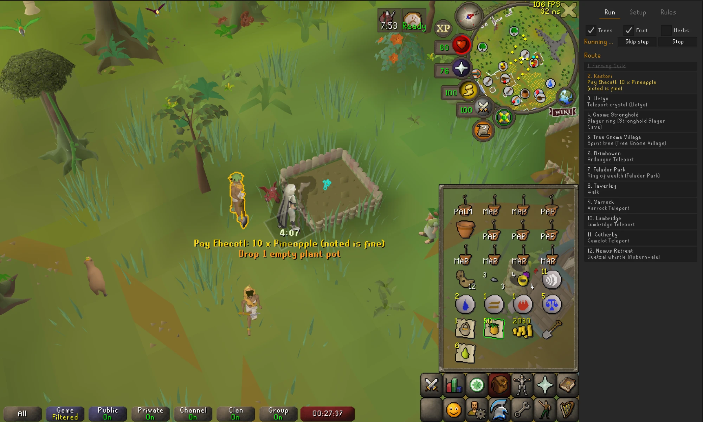
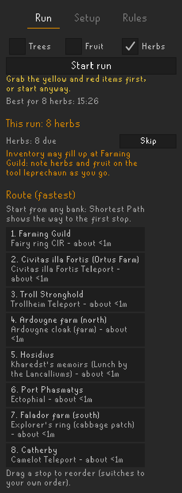
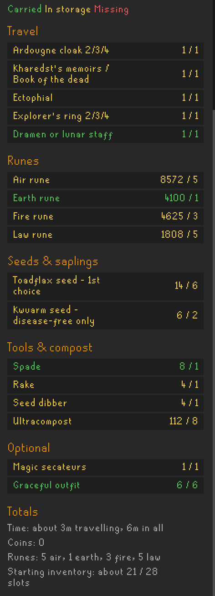
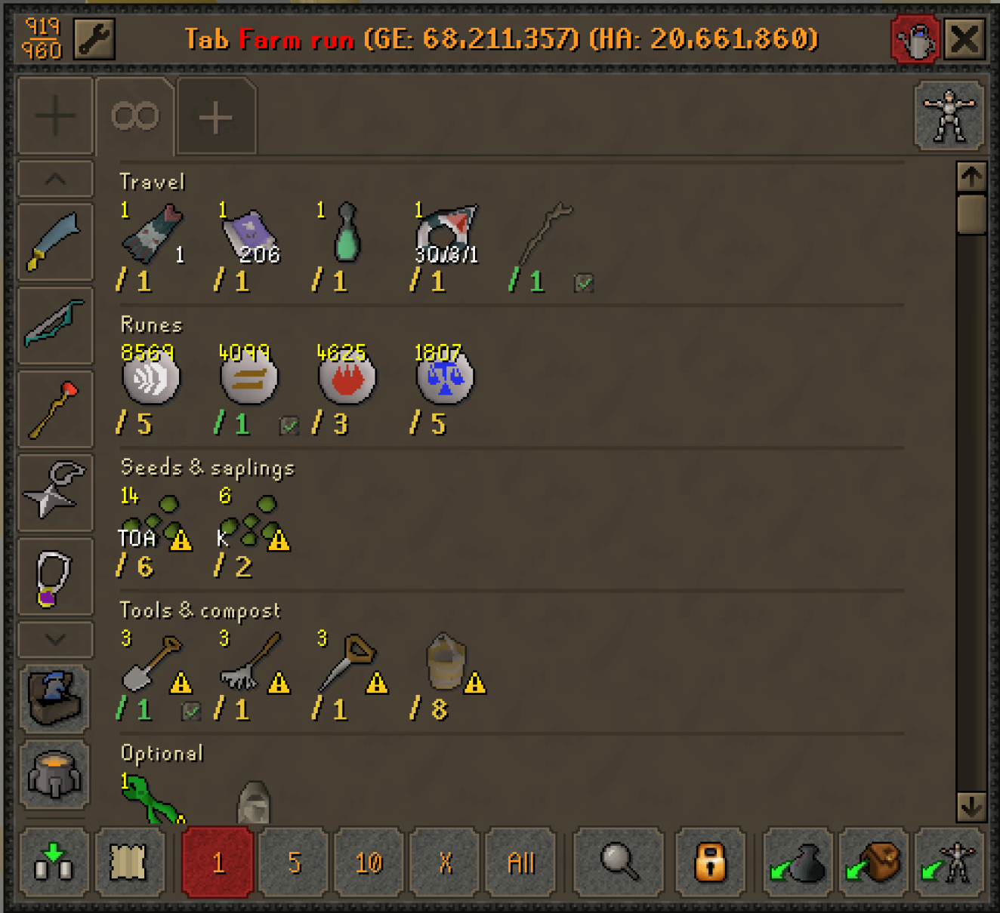
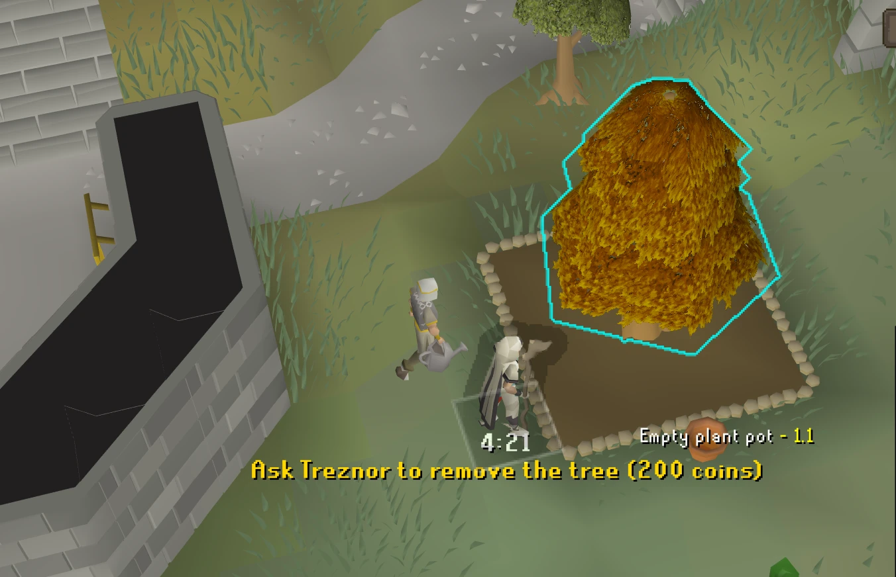
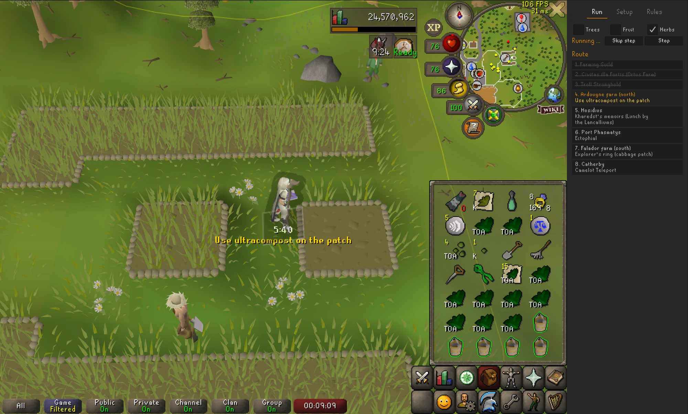
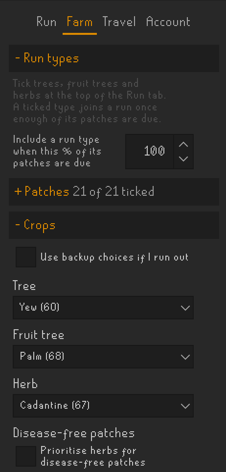
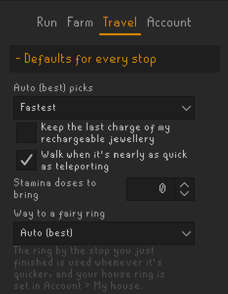
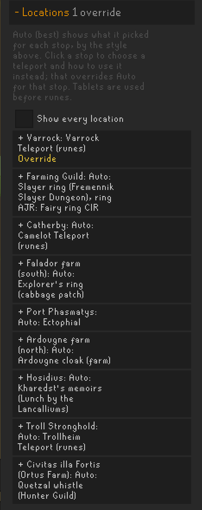

# Farm Run Autopilot

Plans and guides combined tree, fruit tree and herb farming runs: what's due, the fastest route, exactly what
to bring, and step-by-step guidance at every patch.

The plugin never clicks, types or acts for you. It only shows information.

## Features

**Run tab**
- Shows which run types are due (trees, fruit trees, herbs) and counts down to the ones that aren't, with
  buttons to include or skip a type for this run.
- Plans one route across every due patch, using the teleports, items and unlocks you actually have. Pick the
  fastest route, the wiki order, or drag stops into your own order.
- A supply checklist: seeds and saplings, gardener payments (noted is fine), compost, tools, coins, runes or
  tablets, and travel items. Green is carried, yellow is in your bank or at the tool leprechaun, red is
  missing.
- Backup crop choices for when you run out, and your most valuable herbs sent to disease-free patches first.

  
  

**Bank**
- After you press Build run, a "Farm run" button in the bank shows just the items you need, with how many
  of each. It stays hidden while you aren't planning a run.

**During a run**
- Once you have everything (tools at the tool leprechaun count), the run starts itself with step-by-step
  instructions under your character: where to go next, then
  what to do at each patch (pick, check health, clear, rake, compost, plant, pay the gardener).
- The patch is outlined with a hint arrow over it; the gardener is outlined when it's time to pay; the seed,
  compost, tool or teleport to use next is outlined in your inventory.
- Reminders to drop weeds, empty plant pots and buckets, to take an item from the tool leprechaun, or to note
  produce when your inventory is nearly full.
- Steps tick off on their own (planting, composting, paying) and the run finishes itself after the last
  patch, showing your time and your best three times for that kind of run.
- Route time estimates learn from your own runs.

**Farm tab**
- Choose your patches, crops (with backups), protection (pay the gardener or compost only), compost and
  plant cures.
- Save settings as presets (e.g. "Quick herbs") and switch between them from the Run tab.

**Travel tab**
- Every stop shows what **Auto (best)** picked, such as "Camelot Teleport (tablet)", and a dropdown to choose
  the teleport and how to use it yourself: directly, through your house's portal nexus or jewellery box,
  or by fairy ring.
- Pick how Auto chooses: Fastest, Prefer free, Save charges, or Fewest items to bring.
- Tablets come first; tick "Use runes instead" for any stop. Spells from another spellbook are only planned
  when your house altar or Lunar's Spellbook Swap can reach them.
- Charges are tracked across the whole run: jewellery charges, daily-limited teleports (Ardougne cloak,
  Explorer's ring) and items charged by hand (quetzal whistle, Xeric's talisman, pendant of Ates). When
  one runs out partway, Auto picks the next best way.

  
  

**Account tab**
- Quests, diaries, levels, spellbook, charges and some unlocks are detected automatically; anything you
  haven't unlocked is greyed out with what it needs.
- Your house (portal, nexus, jewellery box, spirit tree, fairy ring, spellbook altar), unlocks the game
  doesn't show, highlights and colours.
- **I NEED YOUR HELP!** Some features couldn't be tested by the author. Each one has a guided test: the
  Run tab walks you through it, your settings are put back afterwards, and at the end a button opens a
  GitHub issue with the results filled in for you to check and send.

## How to use

1. Open the Farm Run Autopilot sidebar (the leprechaun icon).
2. Set things up once: the Farm tab has patches, crops, protection and compost; the Travel tab has teleports
   and the route; the Account tab shows what the plugin has detected, plus your house, unlocks and highlights.
3. Tick the run types on the Run tab, which also shows what's due and your patch timers, and press
   **Build run**.
4. Open your bank and click the "Farm run" button to withdraw what you need. The run starts itself once you
   have everything; the timer starts when you teleport or click your first patch (or press **Start now**).
5. Follow the instructions under your character.

Patches are tracked as you visit them. Until then, the plugin uses RuneLite's Time Tracking data if it has
any.

## Privacy

Everything is stored in your RuneLite profile. The plugin makes no network requests. A guided test's GitHub
report only opens in your browser when you press its button, nothing is sent unless you submit it there,
and it never includes your character name.

## Credits

- Generated bank tab approach adapted from [Quest Helper](https://github.com/Zoinkwiz/quest-helper).
- Patch coordinates from [Farming-Helper](https://github.com/Speaax/Farming-Helper).
- Built on [RuneLite](https://github.com/runelite/runelite).

See `THIRD_PARTY_NOTICES` for their licences.

## Licence

BSD 2-Clause, see `LICENSE`.
